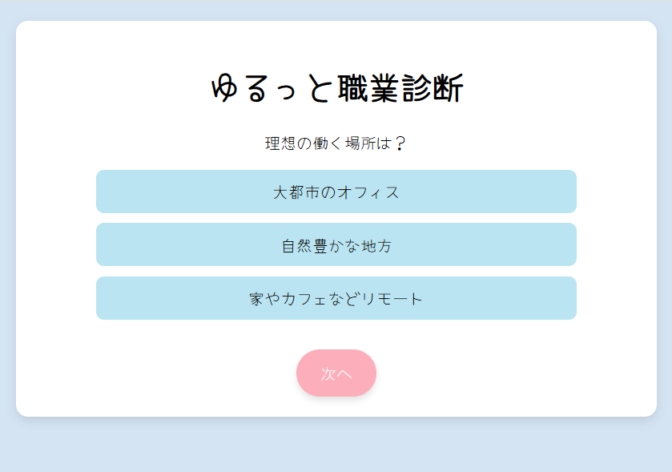

# ゆるっと職業診断 🌸

かわいくて気軽に楽しめる、Webブラウザ上で動作する適職診断アプリです🌸
質問に答えていくと、あなたにぴったりのお仕事がわかります！

## 🎮 操作の流れ

- index.html にアクセスして質問に回答
- 最後の質問が終わると、自動で result.html にジャンプ
- 結果ページで「診断結果」＆「上位3位」を表示
- 「もう一度診断」ボタンでトップに戻る
- 「閉じる（サーバー停止）」で server.py をシャットダウン

  

## 🎬 ゲームデモ（GIF）

ゲームのプレイデモです！どんな感じで遊べるか見てください。


## ⚙️ 技術スタック

- HTML / CSS / JavaScript（フロントエンド）
- JSON（データ形式）
- Python（http.server を使用した簡易Webサーバー）

## 🚀 実行方法

1. **リポジトリをクローン**
   ```bash
   git clone https://github.com/erioonishi/oshigoto_sindan.git
2. **server.py を実行**
   ```bash
   python server.py
3. **サーバーが起動すると以下のURLが表示されます**
   ```bash
   サーバーを起動しました → http://localhost:8000
4. **ブラウザで開く**
   ```bash
   http://localhost:8000 にアクセスすると、診断を開始できます。

## 📂 ディレクトリ構成

```plaintext
oshigoto_shindan/
├── index.html
├── result.html
├── style.css
├── script.js
├── server.py
└── questions.json
```

## 📂 設計図（PDF）Web上での確認のため

- [PDFはこちらから見られます 📄](assets/images/oshigoto.drawio.pdf)

## 💡 今後のアイデア

- 最初に分野を選んでより詳細な診断をできるようにする

## 🥺 ライセンス

このアプリは個人の学習目的で作成されたものであり、**商用利用を禁止**しています。  
その他の利用条件については、[LICENSE](./LICENSE) ファイルをご確認ください。

## 🙌 クレジット

- フォント: Yomogi
- 開発: eri


